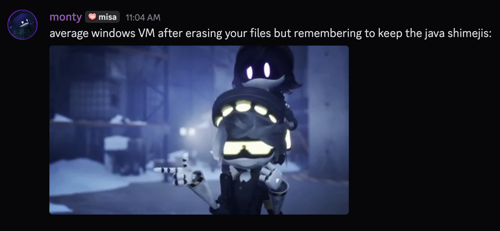

## julia al-otoom // montypythonist

- modules are at my ***[PyPI page](https://pypi.org/user/montypythonist)***
- check out my [portfolio](https://montypythonist.carrd.co/) for more of my projects

currently working on `TAMMI`, my most in-depth project by far

skills/interests/things i'm learning:

have a good day/night!

